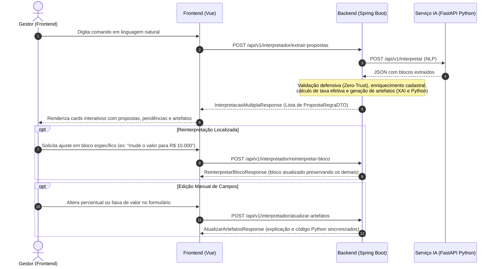

# Contratos Compartilhados de Regras Avançadas, Interpretação e Artefatos Explicativos (S2 - BACK-1)

Este documento especifica a arquitetura de dados e os contratos de comunicação compartilhados entre o **Frontend (Vue.js 3)**, o **Backend Orquestrador (Spring Boot / Java 21)** e o **Serviço de IA (FastAPI / Python / LangChain)** para a Sprint 2 do **ComissionAI**.

---

## 1. Visão Geral da Arquitetura e Fluxo de Comunicação

O fluxo de processamento de regras em linguagem natural para múltiplas propostas segue o modelo Human-in-the-Loop (HITL):



---

## 2. Padrões Numéricos e Precisão Financeira

1. **Taxas e Percentuais de Comissão:**
   * Tipo: Decimal exato (`BigDecimal` no Java, `float` com precisão arredondada ou string formatada no frontend/IA).
   * Escala: **4 casas decimais** (`0.0500` representa $5.00\%$; `0.0025` representa $0.25\%$).
   * Arredondamento: Bancário `RoundingMode.HALF_UP`.
   * Limite Válido: Intervalo estritamente positivo e menor ou igual a 100%: $0.0001 \le \text{taxaFinal} \le 1.0000$.

2. **Valores Monetários e Faixas de Venda:**
   * Tipo: Decimal exato (`BigDecimal` no Java).
   * Escala: **2 casas decimais** (`5000.00` representa R$ 5.000,00).
   * Arredondamento: `RoundingMode.HALF_UP`.

---

## 3. Catálogo de Enums e Tipos

### 3.1 `TipoOperacaoBase`
Define como a taxa da regra se relaciona com a taxa base contratual (`tb_basecomiss`):

| Enum | Descrição | Exemplo de Aplicação |
| :--- | :--- | :--- |
| `DEFINIR_TAXA` | Substitui a taxa da base por uma taxa fixa direta | Pagar $5.00\%$ fixo no canal e-commerce |
| `ACRESCIMO_PONTOS` | Soma pontos percentuais à taxa base contratual | Taxa base $+ 1.50\%$ de comissão |
| `DESCONTO_PONTOS` | Subtrai pontos percentuais da taxa base contratual | Taxa base $- 0.50\%$ de comissão |
| `MULTIPLICADOR_BASE` | Multiplica a taxa base por um fator numérico | $1.5\times$ a taxa base da competência |
| `DIVISOR_BASE` | Divide a taxa base por um fator numérico ($\neq 0$) | Metade da taxa base ($/ 2.0$) |

### 3.2 `OrigemCampo`
Rastreabilidade auditável de cada campo inferido ou atribuído na proposta:

| Enum | Descrição |
| :--- | :--- |
| `TEXTO` | Extraído diretamente do texto em linguagem natural informado pelo gestor |
| `CONTEXTO` | Inferido a partir do contexto da requisição (ex: ano de referência ou loja padrão) |
| `BASE_DADOS` | Consultado nos cadastros persistidos (`tb_brand`, `tb_position`, `tb_basecomiss`) |
| `PADRAO_SISTEMA` | Atribuído por default do sistema (ex: 30 dias de vigência quando omitido) |

### 3.3 `SeveridadePendencia`
Classificação de pendências para tratamento em Human-in-the-Loop (HITL):

| Enum | Severidade | Comportamento no Sistema |
| :--- | :--- | :--- |
| `AVISO` | Não impeditivo | Alerta de conferência. **Permite salvar como rascunho (`DRAFT`)**. |
| `IMPEDIMENTO` | Impeditivo | Falha crítica (ex: divisão por zero, valor negativo, taxa ausente). **Impede ativação da campanha**. |

---

## 4. Estrutura dos Contratos (JSON Schemas)

### 4.1 Bloco de Proposta de Regra (`PropostaRegraDTO`)

```json
{
  "blocoId": "bloco-1",
  "trechoOrigem": "Comissão de 4.5% no canal ecommerce para vendas acima de R$ 5.000",
  "filtros": {
    "canal": "ECOMMERCE",
    "codMarca": 10,
    "descrMarca": "PRETO",
    "codLoja": 75,
    "codCargo": 100,
    "descriCargo": "VENDEDOR LOJA",
    "matricula": "MATRIC-56"
  },
  "condicaoValor": {
    "valorMinimo": 5000.00,
    "minInclusivo": false,
    "valorMaximo": null,
    "maxInclusivo": true
  },
  "operacaoBase": {
    "tipoOperacao": "DEFINIR_TAXA",
    "valorAjuste": 0.0450,
    "referenciaBase": null
  },
  "taxaFinal": 0.0450,
  "referenciasConsultadas": [
    {
      "tipo": "MARCA",
      "identificador": "cod_marca=10",
      "descricao": "Marca PRETO"
    }
  ],
  "origensPorCampo": {
    "canal": "TEXTO",
    "taxa": "TEXTO",
    "condicaoValor": "TEXTO",
    "dataInicio": "PADRAO_SISTEMA",
    "dataFim": "PADRAO_SISTEMA"
  },
  "pendencias": [],
  "completa": true,
  "explicacao": "Aplica taxa de 4.50% (taxa fixa definida diretamente) para vendas no canal ECOMMERCE para a marca PRETO com valor de venda superior a R$ 5000.00, vigendo a partir de 01/10/2026 até 31/10/2026.",
  "pythonEquivalente": "def calcular_comissao(venda: dict) -> float | None:\n    ...\n    return round(valor_float * 0.0450, 2)\n",
  "vigencia": {
    "dataInicio": "2026-10-01",
    "dataFim": "2026-10-31"
  }
}
```

---

## 5. Exemplos de Requisição e Resposta

### Cenário 1: Extração de Múltiplas Propostas com Faixas de Valor
* **Endpoint:** `POST /api/v1/interpretador/extrair-propostas`
* **Requisição:**
```json
{
  "texto": "1. Pagar 5% no canal ecommerce durante outubro.\n2. Para a loja 75, pagar taxa base + 1.5% em vendas acima de R$ 5.000.",
  "contexto": {
    "ano_referencia": 2026,
    "mes_referencia": 10
  }
}
```
* **Resposta (Status 200 OK):**
```json
{
  "tituloSugerido": "Campanha Múltiplas Regras (2 blocos)",
  "quantidadeBlocos": 2,
  "possuiPendencias": true,
  "todasCompletas": true,
  "confiancaGeral": 0.95,
  "propostas": [
    {
      "blocoId": "bloco-1",
      "trechoOrigem": "Pagar 5% no canal ecommerce durante outubro.",
      "filtros": {
        "canal": "ECOMMERCE",
        "codMarca": null,
        "descrMarca": null,
        "codLoja": null,
        "codCargo": null,
        "descriCargo": null,
        "matricula": null
      },
      "condicaoValor": {
        "valorMinimo": null,
        "minInclusivo": true,
        "valorMaximo": null,
        "maxInclusivo": true
      },
      "operacaoBase": {
        "tipoOperacao": "DEFINIR_TAXA",
        "valorAjuste": 0.0500,
        "referenciaBase": null
      },
      "taxaFinal": 0.0500,
      "referenciasConsultadas": [],
      "origensPorCampo": {
        "canal": "TEXTO",
        "taxa": "TEXTO",
        "dataInicio": "PADRAO_SISTEMA",
        "dataFim": "PADRAO_SISTEMA"
      },
      "pendencias": [
        {
          "campo": "filtros",
          "codigo": "PUBLICO_GERAL",
          "mensagem": "Nenhum filtro de público-alvo restrito identificado. A regra se aplicará de forma genérica a todas as vendas.",
          "severidade": "AVISO"
        }
      ],
      "completa": true,
      "explicacao": "Aplica taxa de 5.00% (taxa fixa definida diretamente) para vendas no canal ECOMMERCE.",
      "pythonEquivalente": "def calcular_comissao(venda: dict) -> float | None:\n    if venda.get('canal') != 'ECOMMERCE':\n        return None\n    valor = venda.get('valor_venda')\n    if valor is None or float(valor) <= 0:\n        return None\n    return round(float(valor) * 0.0500, 2)\n",
      "vigencia": {
        "dataInicio": "2026-10-01",
        "dataFim": "2026-10-31"
      }
    },
    {
      "blocoId": "bloco-2",
      "trechoOrigem": "Para a loja 75, pagar taxa base + 1.5% em vendas acima de R$ 5.000.",
      "filtros": {
        "canal": null,
        "codMarca": null,
        "descrMarca": null,
        "codLoja": 75,
        "codCargo": null,
        "descriCargo": null,
        "matricula": null
      },
      "condicaoValor": {
        "valorMinimo": 5000.00,
        "minInclusivo": false,
        "valorMaximo": null,
        "maxInclusivo": true
      },
      "operacaoBase": {
        "tipoOperacao": "ACRESCIMO_PONTOS",
        "valorAjuste": 0.0150,
        "referenciaBase": {
          "tipoBase": "BASE_COMISS",
          "taxaBaseConsultada": 0.0300,
          "descricao": "Taxa Contratual Padrão"
        }
      },
      "taxaFinal": 0.0450,
      "referenciasConsultadas": [
        {
          "tipo": "BASE_COMISS",
          "identificador": "BASE_COMISS",
          "descricao": "Taxa Contratual Padrão"
        }
      ],
      "origensPorCampo": {
        "loja": "TEXTO",
        "condicaoValor": "TEXTO",
        "dataInicio": "PADRAO_SISTEMA",
        "dataFim": "PADRAO_SISTEMA"
      },
      "pendencias": [],
      "completa": true,
      "explicacao": "Aplica taxa de 4.50% (base contratual de 3.00% + acréscimo de 1.50%) para vendas na loja 75 com valor de venda superior a R$ 5000.00.",
      "pythonEquivalente": "def calcular_comissao(venda: dict) -> float | None:\n    if venda.get('cod_loja') != 75:\n        return None\n    valor = venda.get('valor_venda')\n    if valor is None or float(valor) <= 0:\n        return None\n    if float(valor) <= 5000.00:\n        return None\n    return round(float(valor) * 0.0450, 2)\n",
      "vigencia": {
        "dataInicio": "2026-10-01",
        "dataFim": "2026-10-31"
      }
    }
  ]
}
```

---

### Cenário 2: Reinterpretação Localizada de um Bloco
* **Endpoint:** `POST /api/v1/interpretador/reinterpretar-bloco`
* **Requisição:**
```json
{
  "blocoId": "bloco-2",
  "instrucaoAjuste": "No bloco 2, mudar a condição para vendas a partir de R$ 10.000 e acréscimo de 2.0%",
  "propostasAtuais": [ "... lista existente contendo bloco-1 e bloco-2 ..." ],
  "contexto": {}
}
```
* **Resposta (Status 200 OK):**
```json
{
  "blocoModificadoId": "bloco-2",
  "resumoModificacao": "Bloco 'bloco-2' reprocessado com sucesso com base na instrução de ajuste.",
  "propostasAtualizadas": [
    { "... bloco-1 permanece inalterado ..." },
    {
      "blocoId": "bloco-2",
      "trechoOrigem": "Para a loja 75, pagar taxa base + 1.5% em vendas acima de R$ 5.000. [Ajuste: No bloco 2, mudar a condição para vendas a partir de R$ 10.000 e acréscimo de 2.0%]",
      "condicaoValor": {
        "valorMinimo": 10000.00,
        "minInclusivo": true,
        "valorMaximo": null,
        "maxInclusivo": true
      },
      "operacaoBase": {
        "tipoOperacao": "ACRESCIMO_PONTOS",
        "valorAjuste": 0.0200,
        "referenciaBase": {
          "tipoBase": "BASE_COMISS",
          "taxaBaseConsultada": 0.0300,
          "descricao": "Taxa Contratual Padrão"
        }
      },
      "taxaFinal": 0.0500,
      "explicacao": "Aplica taxa de 5.00% (base contratual de 3.00% + acréscimo de 2.00%) para vendas na loja 75 com valor de venda a partir de R$ 10000.00.",
      "completa": true
    }
  ]
}
```

---

### Cenário 3: Atualização Imediata de Artefatos após Edição Manual
* **Endpoint:** `POST /api/v1/interpretador/atualizar-artefatos`
* **Requisição:**
```json
{
  "proposta": {
    "blocoId": "bloco-1",
    "trechoOrigem": "Pagar 5% no canal ecommerce",
    "filtros": {
      "canal": "ECOMMERCE",
      "codMarca": 10,
      "descrMarca": "PRETO",
      "codLoja": null,
      "codCargo": null,
      "descriCargo": null,
      "matricula": null
    },
    "condicaoValor": {
      "valorMinimo": 2000.00,
      "minInclusivo": false,
      "valorMaximo": null,
      "maxInclusivo": true
    },
    "operacaoBase": {
      "tipoOperacao": "DEFINIR_TAXA",
      "valorAjuste": 0.0600,
      "referenciaBase": null
    },
    "taxaFinal": 0.0600,
    "vigencia": {
      "dataInicio": "2026-10-01",
      "dataFim": "2026-10-31"
    }
  }
}
```
* **Resposta (Status 200 OK):**
```json
{
  "blocoId": "bloco-1",
  "taxaCalculada": 0.0600,
  "explicacao": "Aplica taxa de 6.00% (taxa fixa definida diretamente) para vendas no canal ECOMMERCE para a marca PRETO com valor de venda superior a R$ 2000.00, vigendo de 01/10/2026 até 31/10/2026.",
  "pythonEquivalente": "def calcular_comissao(venda: dict) -> float | None:\n    data_venda = str(venda.get('data_venda', ''))\n    if not ('2026-10-01' <= data_venda <= '2026-10-31'):\n        return None\n    if venda.get('canal') != 'ECOMMERCE':\n        return None\n    if venda.get('cod_marca') != 10:\n        return None\n    valor = venda.get('valor_venda')\n    if valor is None or float(valor) <= 0:\n        return None\n    if float(valor) <= 2000.00:\n        return None\n    return round(float(valor) * 0.0600, 2)\n",
  "pendencias": [],
  "completa": true
}
```

---

### Cenário 4: Proposta Incompleta com Pendências Apontadas (Permitida como Rascunho)
* **Caso:** Usuário não informou taxa nem percentual para um público específico.
* **Retorno estruturado:**
```json
{
  "blocoId": "bloco-1",
  "taxaFinal": null,
  "completa": false,
  "pendencias": [
    {
      "campo": "taxaFinal",
      "codigo": "TAXA_NAO_CALCULAVEL",
      "mensagem": "Não foi possível determinar a taxa percentual final da regra.",
      "severidade": "IMPEDIMENTO"
    }
  ]
}
```
* **Regra de Negócio:** Pode ser salva no banco como campanha `DRAFT` (Sprint 2 - BACK-2), mas não pode ser ativada (`ATIVA`) nem enviada para apuração financeira final até que o usuário informe a taxa.

---

### Cenário 5: Erro de Validação de Faixa ou Parâmetro
* **Caso:** Valor mínimo superior ao valor máximo (`valorMinimo: 10000.00`, `valorMaximo: 5000.00`).
* **Retorno HTTP (Status 400 Bad Request):**
```json
{
  "timestamp": "2026-10-06T09:50:00Z",
  "status": 400,
  "error": "Bad Request",
  "message": "Dados de entrada inválidos.",
  "path": "/api/v1/interpretador/atualizar-artefatos",
  "validacoes": [
    {
      "campo": "condicaoValor",
      "motivo": "O valor mínimo de venda (10000.00) não pode ser superior ao valor máximo (5000.00)."
    }
  ]
}
```

---

## 6. Matriz de Mensagens de Erro e Códigos HTTP

| Código HTTP | Erro | Cenário |
| :--- | :--- | :--- |
| `400 Bad Request` | `COMANDO_VAZIO` | Texto do comando em linguagem natural não informado ou composto exclusivamente por espaços |
| `400 Bad Request` | `DIVISAO_POR_ZERO` | Operação `DIVISOR_BASE` com fator nulo ou igual a zero |
| `400 Bad Request` | `FAIXA_VALOR_INCOERENTE` | `valorMinimo > valorMaximo` nos limites monetários |
| `400 Bad Request` | `DATA_FIM_ANTERIOR_INICIO` | Data final de vigência anterior à data inicial |
| `404 Not Found` | `BLOCO_NAO_ENCONTRADO` | `blocoId` informado na reinterpretação não existe na lista de propostas |
| `503 Service Unavailable`| `AI_SERVICE_UNAVAILABLE` | Módulo Python de IA offline ou inacessível |
| `504 Gateway Timeout` | `AI_TIMEOUT` | Processamento de inferência do modelo LLM ultrapassou o teto de 35 segundos |
